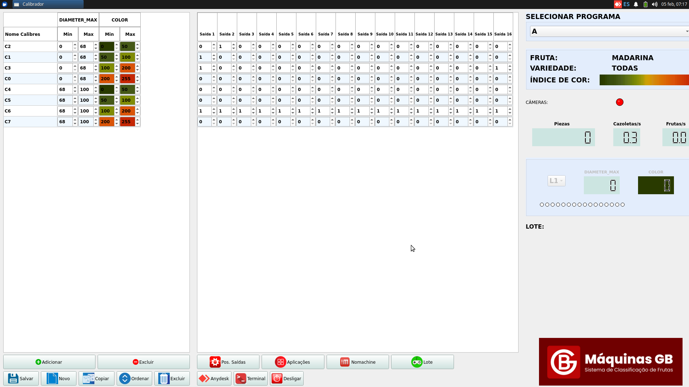

# Calibrador: Software de control de un calibrador de vision de frutas


 



## Ficheros de Configuracion   

### config.json
```bash
{
 "dimwindow": {
    "dimX": 1920,
    "dimY":1060
  },

  "logo": {
    "showLogo": true,
    "dimX": 380,
    "dimY":200
  },
  
  "general": {
    "debugMode_ciclo_ms": 300,
    "debugMode": true,
    "pathPrograms": "/home/pi/CalibradorParams/Programs",
    "pathConfig": "/home/pi/CalibradorParams/Config",
    "pathPartidas": "/home/pi/CalibradorParams/Partidas"
  },

  "config": {
    "numLineas": 1, 	
    "numSalidas": 16,
    "idioma": "PT" 
  },

  "dimensiones": {
    "nombre": ["DIAMETER_MAX", "DIAMETER_MIN", "COLOR", "QUALITY"], 
    "domain_min_value": [0,0,0,0],
    "domain_max_value": [9999,9999,255,255]	
  }

}
```
### frutas.json
```bash
{
 

  	"MADARINA": {
  		"colorIndex": "NARANJA",
  		"VARIEDADES": ["TODAS", "CLEMENULES","MARISOL","ORONULES"]
    	},
    	
  	"TOMATE": {
  		"colorIndex": "HUE",
  		"VARIEDADES": ["TODAS", "RAF","PERA","MONTEROSA"]
  	}

  
}
```
### Config/config_pos_salidas.json   

```bash
{
    "positions": [
        0,
        1,
        2,
        3,
        4,
        5,
        6,
        7,
        8,
        9,
        10,
        11,
        12,
        13,
        14,
        20
    ]
}
```  

## Configuracion de los puertos   

El puerto de la izquierda sera el puerto de las camaras   
El puerto de la derecha sera el puerto de las tarjetas expulsoras   


## Entrada del sensor  

   

   


## CamaraManager "Thread" (Clase principal) 
1.- CalibrationProgram* _calibrationProgram es el programa activo actual, se puede cambiar desde el GUI (MainWindow)   
2.- OutputBoardManager*  _outputBoardManager
3.- Fotocelula* _fotocelula, Thread que lee del GPIO de OrangePi5 Plus  

  

## CalibersTable & SalidasTable (Principales clases del GUI, visualizan un programa de calibracion)   

Estas dos clases son las dos principales del GUI, visualizan un objeto CalibrationProgram   

 

## CalibrationProgram (Clase para crear los objetos programa de calibracion)   
 
En CalibrationProgram se define lo que es un  programa de calibracion  

      

## CaliberClassifier  (Clase principal)   

La clase CaliberClassifier la utiliza CamaraManager  para dados los parametros de una fruta, descubrir el calibre asociado.   

## Dialogo Test de Salidas   

   


## Programas de Test

### Test Sensor  (sudo ./TestSensor)

Este  programa de test sirve para comprobar la lectura del sensor esta funcionando bien.  

```bash
pi@pi-ora5:~$ sudo ./TestSensor 
[sudo] password for pi: 
Test Fotocelula en pin GPIO (wPi): 0
Pulsa Ctrl+C para salir...
value:1 duration:34444ms
value:1 duration:10ms
value:1 duration:10ms
Rising edge detected - Notifying...
Detection time: 34464 ms (desde epoch)
Detection received!
Señal detectada en el sensor!
value:1 duration:10ms
value:1 duration:10ms
value:1 duration:10ms
value:1 duration:10ms
value:1 duration:10ms
value:1 duration:10ms
value:1 duration:10ms
value:1 duration:10ms  
```   
Con esta aplicación vemos el comportamiento de la clase Fotocelula, cada 10ms mira en la GPIO (posicion fisica 3) y muestra el valor :   

value:1 duration:10ms
Si value:1 -> el sensor no ve objeto
Si value:0 -> el sensor ve objeto
Este thread mandara un mensaje de notificacion de "cazoleta" :
**Rising edge detected - Notifying...** cuando ve un flanco de paso de value:0 a value:1 y se mantiene value:1 tres veces.   
Este filtrado del notificacion de "cazoleta" tiene parametros constantes en Fotocelula.h igual abria que parametrizar por fichero de configuracion!.
Vemos que aqui esta enviando un Rising edge detected - Notifying... incorrecto, porque no habia sensor.   
Se soluciona inicializando 

```C++
bool _previous_state = true;     ///< Previous state for edge detection
```  
Era un pequeño bug!. Solucionado

```bash
Test Fotocelula en pin GPIO (wPi): 0
Pulsa Ctrl+C para salir...
value:1 duration:74798ms
value:1 duration:10ms
value:1 duration:10ms
value:1 duration:10ms
value:1 duration:10ms
value:1 duration:10ms
value:1 duration:10ms
value:1 duration:10ms
value:1 duration:10ms
value:1 duration:10ms
value:1 duration:10ms
``` 